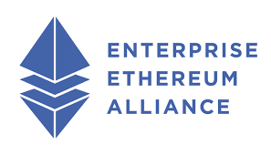

# EEA Community Projects Governing Board (PGB)

The Project Governing Board sets overall strategic direction for the EEA Community Projects and formally approves released work products.

PGB members include representatives of [EEA Community Projects sponsor organizations]() and representatives from the community at-large who serve on the Technical Steering Committee:

<iframe style="border-style: none;" width="800" height="400" src="https://docs.google.com/spreadsheets/d/e/2PACX-1vT38MUZFWO1ISzQWC6wSulN7IJCmYdSOIxBiofgO4c8mRF0hOuLEO59bW6McK2Lm0DgJkpaPLAf38AI/pubhtml?gid=463834327&single=true&widget=true&headers=false&chrome=false&single=false&gridlines=false&range=A1:E"></iframe>

For information on joining sponsoring these projects or joining the governing board, please contact [communications@oasis-open.org](mailto:communications@oasis-open.org).
